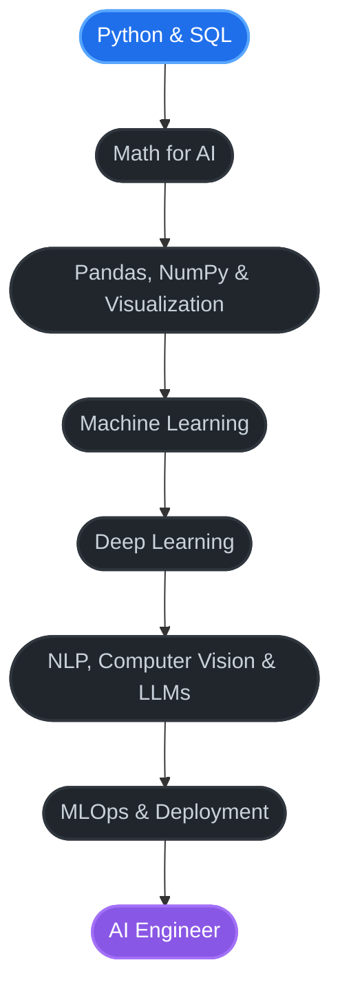

# Hi there 👋

---

## About Me

> I'm Fazle Rabbi, a student of Artificial Intelligence and Data Science, working toward a career as an AI engineer. I am currently building my foundation in SQL and Python, solving problems on Codeforces, exploring datasets on Kaggle, and building hands-on projects with Arduino.

| | |
|:--|:--|
| **Studying** | Artificial Intelligence & Data Science |
| **Career Goal** | AI Engineer |
| **Currently Learning** | SQL |
| **Interests** | Machine learning, problem solving, electronics |
| **Fun Fact** | I think I'm unpredictable |

---

## Tech Stack

<b>Languages</b>  

<b>Data & Analysis</b>  

<b>Tools & Hardware</b>  

<b>Learning Next: ML & AI</b>  

---

## AI Engineer Roadmap

🔵 In progress &nbsp;·&nbsp; ⚫ Up next &nbsp;·&nbsp; 🟣 Goal

### Roadmap Details

| Phase | Focus | Key Topics |
|:------|:------|:-----------|
| **1. Foundations** | Python & SQL | Data structures, functions, queries, joins |
| **2. Math** | Math for AI | Linear algebra, probability, statistics, calculus |
| **3. Data** | Analysis & Visualization | Pandas, NumPy, Matplotlib, data cleaning |
| **4. Machine Learning** | Classical ML | Regression, classification, clustering, model evaluation (scikit-learn) |
| **5. Deep Learning** | Neural Networks | PyTorch or TensorFlow, CNNs, RNNs, Transformers |
| **6. Specialization** | Applied AI | NLP, Computer Vision, LLMs and RAG |
| **7. Deployment** | MLOps | Git workflows, Docker, REST APIs (FastAPI), cloud basics |

---

## Current Focus

| Area | Details |
|:-----|:--------|
| **Databases** | SQL queries, joins, and data retrieval |
| **Programming** | Python for data analysis and problem solving |
| **Data Analysis** | Exploring datasets with Pandas and NumPy |
| **AI Foundations** | Building math and machine learning fundamentals |
| **Electronics** | Hands-on Arduino projects |

---

## Planned Projects

- [ ] Data analysis project on a Kaggle dataset
- [ ] House price prediction with scikit-learn
- [ ] Image classifier with a neural network
- [ ] Chatbot using an LLM API
- [ ] Deploy a trained model as a web API

---

## Connect

> [!NOTE]
> Open to collaboration, questions, and conversations about AI and data.

---

Always learning. Always building.

