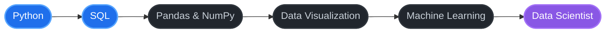

# Hi there 👋 

 

---

## About Me

> I'm Fazle Rabbi, a student of Artificial Intelligence and Data Science, working toward a career as a data scientist. I am currently building my foundation in SQL and Python, solving problems on Codeforces, exploring datasets on Kaggle, and building hands-on projects with Arduino.

| | |
|:--|:--|
| **Studying** | Artificial Intelligence & Data Science |
| **Currently Learning** | SQL |
| **Interests** | Data analysis, problem solving, electronics |
| **Fun Fact** | I think I'm unpredictable |

---

## Tech Stack

<b>Languages</b>  

<b>Data & Analysis</b>  

<b>Tools & Hardware</b>  

---

## Learning Roadmap

🔵 In progress &nbsp;·&nbsp; ⚫ Up next &nbsp;·&nbsp; 🟣 Goal

---

## Current Focus

| Area | Details |
|:-----|:--------|
| **Databases** | SQL queries, joins, and data retrieval |
| **Programming** | Python for data analysis and problem solving |
| **Data Analysis** | Exploring datasets with Pandas and NumPy |
| **Electronics** | Hands-on Arduino projects |

---

